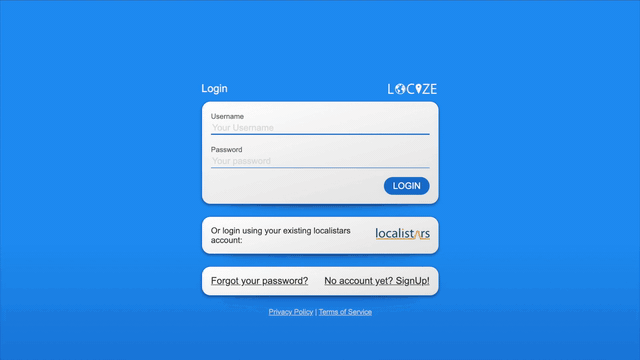

# For Enterprises

## Is i18n enough?

We believe not. The closer the release date of your product gets the more obvious it gets, that instrumenting your code for localization is not enough.

There are more points to address:

* How does the translation process work?
* How do the source files get to the translators and back?
* How do you keep track which parts are already translated and which parts not - and additional are all target languages fully translated?
* How you deploy new languages after release?
* How do you handle versioning?
* How you update / fix typos in translations after deployment?

Translation Management Systems are a great help. But most tools out there are build for onetime translation of your documents. Not for continuously translating your application. So there is still a gap between the development and the translation process.

## Locize

[Locize](http://locize.com/?utm_source=i18next_com&utm_medium=gitbook) is a localization as a service platform made by i18next. The close integration of i18next brings a lot of additional value and asserts you an additional level of support and saves you endless time spent on localization.

Locize brings you:

* A beautiful editor to edit your translations
* Enables a continuous localization process
* An incontext editor to edit on your own website
* Progress reporting
* Usage reporting
* Plural convertion between languages
* Support for versions
* Gets your missing keys passed directly to the project
* Hosts translation on its CDN and allows for automatic or manual publishing \(You still have the option to host translations yourself\)

