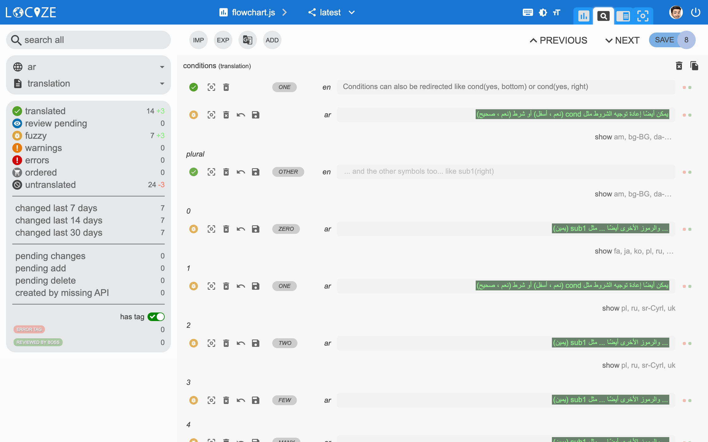

# Plurals

## Plurals

Plural can be combined with interpolation, context, ...


Note: The variable name must be `count`.



If you need multiple counts, take a look at [nesting](nesting.md#passing-options-to-nestings)


### Singular / Plural

keys

```javascript
{
  "key": "item",
  "key_plural": "items",
  "keyWithCount": "{{count}} item",
  "keyWithCount_plural": "{{count}} items"
}
```

sample

```javascript
i18next.t('key', {count: 0}); // -> "items"
i18next.t('key', {count: 1}); // -> "item"
i18next.t('key', {count: 5}); // -> "items"
i18next.t('key', {count: 100}); // -> "items"
i18next.t('keyWithCount', {count: 0}); // -> "0 items"
i18next.t('keyWithCount', {count: 1}); // -> "1 item"
i18next.t('keyWithCount', {count: 5}); // -> "5 items"
i18next.t('keyWithCount', {count: 100}); // -> "100 items"
```

### Languages with multiple plurals

Sample uses arabic which has 5 plural forms beside the singular.

keys

```javascript
{
  "key_0": "zero",
  "key_1": "singular",
  "key_2": "two",
  "key_3": "few",
  "key_4": "many",
  "key_5": "other"
}
```

sample

```javascript
i18next.t('key', {count: 0}); // -> "zero"
i18next.t('key', {count: 1}); // -> "singular"
i18next.t('key', {count: 2}); // -> "two"
i18next.t('key', {count: 3}); // -> "few"
i18next.t('key', {count: 4}); // -> "few"
i18next.t('key', {count: 5}); // -> "few"
i18next.t('key', {count: 11}); // -> "many"
i18next.t('key', {count: 99}); // -> "many"
i18next.t('key', {count: 100}); // -> "other"
```

### How to find the correct plural suffix?

You can use this small utility to get the correct plural suffixes.

[source code](https://jsfiddle.net/sm9wgLze)

_Or try_ [_translation-check_](https://github.com/locize/translation-check)_, it shows an overview of your translations in a nice UI. It shows also the appropriate plural forms._

#### Or you use a smart translation management system, like [locize](https://locize.com)



### Interval plurals

Want to define phrases expressing the number of items lies in a range. Like _a few items_ or _a lot of items_.

You will need to add a post processor: [i18next-intervalplural-postprocessor](https://github.com/i18next/i18next-intervalplural-postprocessor)

```javascript
import i18next from 'i18next';
import intervalPlural from 'i18next-intervalplural-postprocessor';

i18next
  .use(intervalPlural)
  .init(i18nextOptions);
```

keys

```javascript
{
  "key1": "{{count}} item",
  "key1_plural": "{{count}} items",
  "key1_interval": "(1){one item};(2-7){a few items};(7-inf){a lot of items};",
  "key2": "{{count}} item",
  "key2_plural": "{{count}} items",
  "key2_interval": "(1){one item};(2-7){a few items};"
}
```

sample

```javascript
i18next.t('key1_interval', {postProcess: 'interval', count: 1}); // -> "one item"
i18next.t('key1_interval', {postProcess: 'interval', count: 4}); // -> "a few items"
i18next.t('key1_interval', {postProcess: 'interval', count: 100}); // -> "a lot of items"

// not matching into a range it will fallback to
// the regular plural form
i18next.t('key2_interval', {postProcess: 'interval', count: 1}); // -> "one item"
i18next.t('key2_interval', {postProcess: 'interval', count: 4}); // -> "a few items"
i18next.t('key2_interval', {postProcess: 'interval', count: 100}); // -> "100 items"
```

